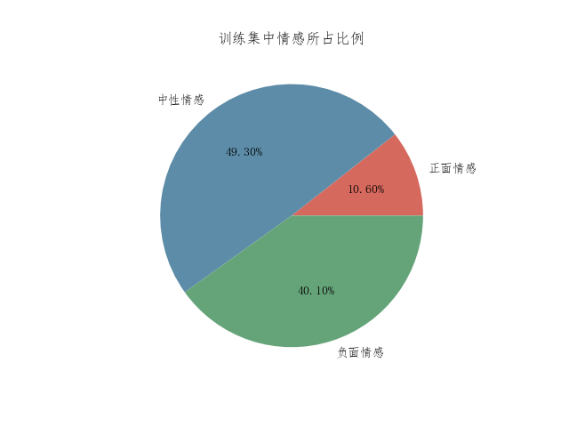
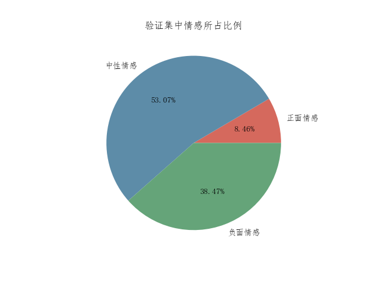

# 基于LSTM的互联网新闻情感分析--大数据中的机器学习算法

## 1.项目背景

随着各种社交平台的兴起，网络上用户的生成内容越来越多，产生大量的文本信息，如新闻、微博、博客等，面对如此庞大且富有情绪表达的文本信息，完全可以考虑通过探索他们潜在的价值为人们服务。因此近年来情绪分析受到计算机语言学领域研究者们的密切关注，成为一项进本的热点研究任务。

尤其该项目和我的研究方向有很大的契合性，我研究的方向是云中的大数据成本优化，对于这种海量的数据更有研究的欲望。该项目目标在于对庞大的数据集集中精准的区分文本的情感极性，感情在该项目中分为正中负三类。

该项目有很强的实用价值，能够引导我们在面对浩如烟海的新闻信息时，精确识别蕴藏在其中的情感倾向，对舆情有效监控、预警及疏导，对舆情生态系统的良性发展有着重要的意义。

## 2.项目数据集介绍

从网上找的一个新闻的数据集--Train_DataSet.csv、Train_DataSet_Label.csv、Test_DataSet.csv。

其中Train_DataSet.csv和Train_DataSet_Label.csv分别是训练数据集和训练数据集的标签。

我们需要对Test_DataSet.csv中的新闻数据进行情感极性分类，其中正面情绪对应0，中性情绪对应1以及负面情绪对应2。

**Train_DataSet.csv数据集结构：**


| 列名    | 含义       |
| ------- | ---------- |
| id      | 新闻的ID   |
| title   | 新闻的标题 |
| content | 新闻的内容 |


**Train_DataSet_Label.csv**数据集结构：


| 列名  | 含义           |
| ----- | -------------- |
| id    | 新闻的ID       |
| label | 新闻的情感标签 |

**项目任务就是设计算法对新闻的标题和内容进行分析，从而确定测试集上的新闻的情感极性--正面情绪，中性情绪和负面情绪。**

## 3.项目算法设计

在参考了大量论文和技术博客的基础上，最终选择LSTM网络构建模型进行情感分析。

主要参考论文和技术博客：

https://zhuanlan.zhihu.com/p/79064602

https://blog.csdn.net/weixin_44799217/article/details/116521289

https://pytorch.org/docs/stable/generated/torch.nn.LSTM.html

http://colah.github.io/posts/2015-08-Understanding-LSTMs/

http://www.bioinf.jku.at/publications/older/2604.pdf

### 3.1 数据预处理

在设计LSTM网络对新闻中的情感进行分析之前，我们需要先对数据集--Train_DataSet.csv、Train_DataSet_Label.csv和Test_DataSet.csv，进行预处理。

需要进行的处理

- Train_DataSet.csv和Train_DataSet_Label.csv数据集中id字段不一样，需要将两个数据集按照id进行合并，并且将title和content字段进行合并
-  需要将自然语言情感处理中无用的标点符号、无用符号和停用词进行删除
- 对数据集进行分词
- 将训练数据集拆分为训练数据集和验证数据集

关键技术

- 停用词表--自动过滤掉对于情感分析无用的字或词。本文中用到四个常用的停用词表

  | 词表名                         | 词表文件            |
  | ------------------------------ | ------------------- |
  | 中文停用词表                   | cn_stopwords.txt    |
  | 哈工大停用词表                 | hit_stopwords.txt   |
  | 百度停用词表                   | baidu_stopwords.txt |
  | 四川大学机器智能实验室停用词库 | scu_stopwords.txt   |

- 对数据集进行分词--中文分词就是在一个中文序列的词与词之间加上空格或者其他边界标志进行分隔，从而达到可以将语言量化的目的。本文中使用现在学界最常用的[**jieba**分词](https://github.com/fxsjy/jieba)。

预处理后的效果：

训练数据集：


验证数据集：


测试数据集（先将标签默认设置为0）：


可以看到在停用词和分词的使用下文本都变成了算法易于处理的一个个词语。

统计一下训练数据集中各个情感所占的比例：



验证集中各个情感所占比例：



### 3.2 LSTM神经网络设计

#### 3.2.1 LSTM神经网络

LSTM（长短文记忆（Long Short-Term Memory））是一种RNN模型。

RNN（Recurrent neural network）循环神经网络是一些列能够处理**序列数据**的神经网络的总称。它们是带有循环的网络，允许信息持续存在。下图是RNN一个单元的结构：


对于一个单元$A$,其中$X_t$是一些输入，输出值是$h_t$。循环允许信息从网络的一个步骤传递到下一个步骤。将单元内部展开就是下图的结构。


但是一般的RNN网络存在一个问题就是当前的输出只与前一个单元有关，但是很多情况下当前的输出也和很久之前的单元有关，而一般的RNN网络无法解决这个问题。如下图$h_3$的结果与$X_0$以及$X_1$有关，但是$h_3$并不能接收到$X_1$和$X_2$的信息。这个问题就是**The Problem of Long-Term Dependencies**。


LSTM网络可以解决这一问题。LSTM网络的结构如下图：


LSTM的关键在于有能力在细胞状态中删除或添加信息，这是由一种叫做门（gate）的结构仔细调节的。门是一种有选择地让信息通过的方式。它们由sigmoid神经网络层和逐点乘法运算组成。


在LSTM中存在四种门（gate）：

- 遗忘门（forget gate）--决定我们将从单元格状态中丢弃哪些信息

  

- 输入门（input gate）--决定我们将在单元格状态中存储哪些新信息

  

- 更新门（update gate）--将新信息和需要保留信息的cell state拼接，得到新的cell state

  

- 输出门（output gate）--决定输出什么信息。

  


#### 3.2.2 pytorch构建LSTM神经网络

在pytorch的torch.nn包下有一个LSTM类，里面是LSTM的实现。对于输入队列中的每一个元素每一层都进行如下的运算：
$$
i_t = \sigma(W_{ii}x_t+b_{ii}+W_{h_i}h_{t-1}+b_{h_i})\\
f_t = \sigma(W_{if}x_t+b_{if}+W_{h_f}h_{t-1}+b_{h_i})\\
g_t = tanh(W_{ig}x_t+b_{ig}+W_{hg}h_{t-1}+b_{hg})\\
o_t = \sigma(W_{io}x_t+b_{io}+W_{ho}h_{t-1}+b_{ho})\\
c_t=f_t \odot c_{t-1}+i_t \odot g_t\\
h_t = o_t \odot tanh(c_t)
$$
其中$h_t$是时间$t$处的隐藏单元，$c_t$是时间$t$处的单元格状态，$x_t$是时间$t$时的输入，$h_{t-1}$是时刻$t-1$时层的隐藏状态，或者是时刻$o$时的初始隐藏状态,并且$i_t,f_t,g_t,o_t$是输入，遗忘，更新和输出门。$\sigma$是sigmoid函数，$\odot$是Hadamard积。

构造函数的参数

- input_size:输入x的期望特征数目
- hidden_size：隐藏层的单元数
- num_layers：隐藏层的层数
- dropout：如果非零，则在除最后一层外的每一层LSTM输出上引入Dropout层，Dropout概率等于Dropout,默认值:0
- bidirectional:如果为True，则变为双向LSTM。默认值:FALSE

构架的模型结构：

```pyt
Net(
  (embedding): Embedding(168591, 200)
  (lstm): LSTM(200, 256, num_layers=3, dropout=0.2, bidirectional=True)
  (fc): Linear(in_features=512, out_features=3, bias=True)
  (dropout): Dropout(p=0.5, inplace=False)
)
=================================================================
Layer (type:depth-idx)                   Param #
=================================================================
├─Embedding: 1-1                         33,718,200
├─LSTM: 1-2                              4,091,904
├─Linear: 1-3                            1,539
├─Dropout: 1-4                           --
=================================================================
Total params: 37,811,643
Trainable params: 37,811,643
Non-trainable params: 0
=================================================================
```

- embedding是嵌入层--将数据转换为机器可以处理的词向量
- lstm是lstm网络--输入是200，有256个单元，网络共有三层

词向量：词向量 (Word Embeddings)通过对大量的文本语料进行训练，对每一个词 (word type) 返回一个n维的实数向量。向量表征了每个词的单词的句法和语义信息，这些信息可用于解决各种NLP任务。在中文任务中，词向量的单位除了词 (word) 以外也可以是字 (character) 或者 sub-character.

本项目中用到两个词向量文本--在wordEmbeddings目录下。经过反复实验最终采用tencent-ailab-embedding-zh-d200-v0.2.0-s.txt词向量，该词向量是[腾讯提供](https://ai.tencent.com/ailab/nlp/en/download.html)。

## 4.通过pytorch框架构建模型并训练

主要通过pytorch框架进行数据的预处理，分词，词向量的合成，构建LSTM模型并训练LSTM模型，并且在验证集上验证准确率。

以来的框架和Python包的版本(包含使用GPU加速必须的包)：

```python
# Name                    Version                   Build  Channel
cuda                      11.7.1                        0    nvidia
cuda-nvcc                 11.7.99                       0    nvidia
cuda-toolkit              11.7.1                        0    nvidia
cuda-tools                11.7.1                        0    nvidia
cuda-visual-tools         11.7.1                        0    nvidia
cudatoolkit               10.2.89              h74a9793_1
gym                       0.21.0           py37h4038f58_2    conda-forge
jieba                     0.42.1                   pypi_0    pypi
numpy                     1.21.5           py37h7a0a035_3
pandas                    1.3.5            py37h6214cd6_0
python                    3.7.15               h6244533_0
pytorch                   1.8.0           py3.7_cuda10.2_cudnn7_0    pytorch
pytorch-cuda              11.7                 h67b0de4_0    pytorch
torchaudio                0.8.0                      py37    pytorch
torchfile                 0.1.0                      py_0    conda-forge
torchtext                 0.9.0                      py37    pytorch
torchvision               0.2.2                      py_3    pytorch
visdom                    0.1.8.9                       0    conda-forge
```

### 4.1 数据预处理

数据预处理的代码在preprocess.py文件中。

### 4.2 LSTM模型的构建

模型构建的代码在net.py文件中。

### 4.3 训练模型

训练过程中用到的参数：

```python
FIX_CHARS = 200  # 句子的最大长度
EMBEDDING_DIM = 200  # 词向量的维度 200--对映wordEmbeddings中的tencent文件 300则对映sgns文件
EPOCHS = 20  # epoch的个数
BATCH_SIZE = 64  # batch大小
HIDDEN_DIM = 256  # 隐藏层长度128 256 64
LR = 1e-4  # 优化器学习率 1e-4
WEIGHT_DECAY = 1e-5  # 优化器衰减系数 1e-2 1e-4
device = torch.device('cuda')  # 是否GPU加速 cuda CPU
```

通过更改参数，查看模型的表现：val_acc是在验证数据集上的准确率，loss是在训练集上的损失，acc是在训练集上的准确率。

经过大量测试发现词向量选择腾讯的文件，准确率普遍高一些；

#### 4.3.1 调参----学习率

1. 学习率WEIGHT_DECAY 1e-2

   ```python
   模型的训练时间是 0:10:08.777473
   验证集最优的准确率为：0.541082974137931
   验证集最优的epoch为：0
   ```

   

2. 学习率WEIGHT_DECAY 1e-3

    ```python
    模型的训练时间是 0:10:12.535782
    验证集最优的准确率为：0.7947198275862069
    验证集最优的epoch为：14
    ```

   

   

3. 学习率WEIGHT_DECAY 1e-5

   ```python
   模型的训练时间是 0:10:24.208980
   验证集最优的准确率为：0.8072467672413793
   验证集最优的epoch为：12
   ```

   

   

4. 学习率WEIGHT_DECAY 1e-7

   ```python
   模型的训练时间是 0:10:14.015466
   验证集最优的准确率为：0.813757183908046
   验证集最优的epoch为：14
   ```

   

5. 学习率WEIGHT_DECAY 1e-9

   ```python
   模型的训练时间是 0:10:16.007069
   验证集最优的准确率为：0.8124551005747126
   验证集最优的epoch为：5
   ```

   

   ​	

**最终选择学习率为1e-7**

#### 4.3.2 调参--隐藏层单元个数（固定学习率为1e-7）

1. 256个单元

   ```python
   模型的训练时间是 0:10:14.015466
   验证集最优的准确率为：0.813757183908046
   验证集最优的epoch为：14
   ```

   

2. 512个单元

   ```python
   模型的训练时间是 0:21:07.370129
   验证集最优的准确率为：0.8072467672413793
   验证集最优的epoch为：17
   ```

   

3. 128个单元

   ```python
   模型的训练时间是 0:08:14.065313
   验证集最优的准确率为：0.817663433908046
   验证集最优的epoch为：16
   ```

   

4. 64个单元

   ```py
   模型的训练时间是 0:07:46.294290
   验证集最优的准确率为：0.8046426005747126
   验证集最优的epoch为：16
   ```

   

   **感觉影响不大，最终选用128个单元**

#### 4.3.3 调参--隐藏层个数（固定学习率为1e-7，隐藏层单元数为128）

1. 3层

   ```python
   模型的训练时间是 0:07:52.806668
   验证集最优的准确率为：0.817663433908046
   验证集最优的epoch为：10
   ```

2. 2层

   ```python
   模型的训练时间是 0:04:34.881080
   验证集最优的准确率为：0.8080100574712644
   验证集最优的epoch为：14
   ```

3. 4层

   ```python
   模型的训练时间是 0:12:20.845426
   验证集最优的准确率为：0.798895474137931
   验证集最优的epoch为：9
   ```

4. 5层

   ```python
   模型的训练时间是 0:17:11.889534
   验证集最优的准确率为：0.7986260775862069
   验证集最优的epoch为：9
   ```

   

**最终隐藏层数选择3**

**最终经过训练，我们模型在测试集上的表现能够达到80%以上。**

## 

